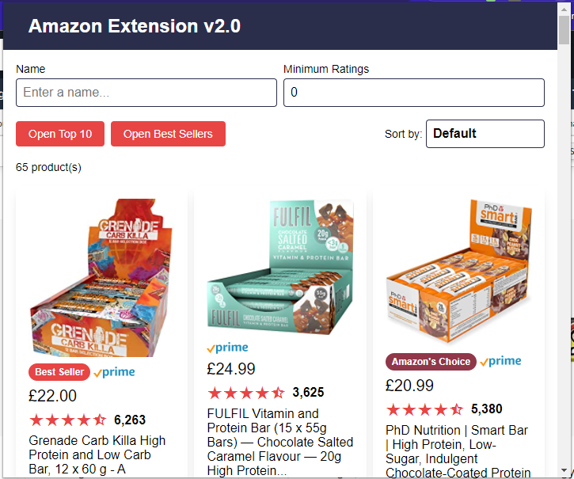

# Amazon Extension v2.0


## About this Project

A Chrome Extension that provides more search/filter/sort functionality on Amazon search results pages.



### Built with

- Chrome Extensions
- React
- Sass
- Vite

## Getting Started

### Prerequisites

- Node

### Installation

1. Install the dependencies.

```
npm i
```

2. Compile the project.

```
npm run build
```

3. Deploy locally - see deployment section.

After each change, re-compile and press the refresh button on the extension on the Chrome Extensions page.

## Deployment

1. Open Chrome to "chrome://extensions/".

2. Enable developer mode in the top right.

3. Click "load unpacked" in the top left.

4. Select the dist folder in this repo.

## Usage

1. Search for something on Amazon.

2. Press the extension icon in the top left.

## Roadmap

- [ ] Fix products with a price range
- [ ] Fix Amazon Choice image as product image
- [ ] Icon

## Release History

- v0.2.0
  - All base features
- v0.1.0
  - Initial design
